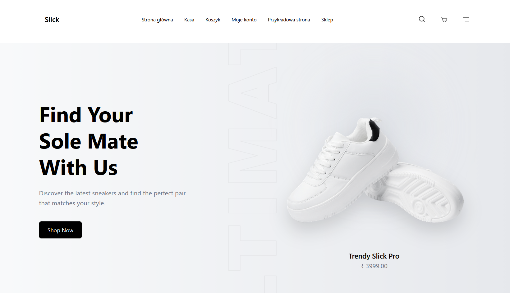

# Slick – WooCommerce Store (Sage Theme)

Modern WooCommerce storefront built with **Sage 10**, **TailwindCSS**, and **Vite**.

The project demonstrates a clean component-based architecture using **Blade templates** inside WordPress.

## Stack

- WordPress
- WooCommerce
- Sage 10 (Roots)
- Blade templates
- TailwindCSS
- Vite
- Laravel-style components

## Features

- Custom WooCommerce product grid
- Blade components for UI elements
- Reusable UI system:
  - Button component
  - Badge component
  - Product card component
  - Icon component
- Responsive hero section
- Floating product animation
- Discount badges with dynamic calculation
- Hover product images (gallery support)

## Development

Install dependencies:

composer install
npm install

Start dev server:

npm run dev

Build assets:

npm run build

## WooCommerce Integration

Products are rendered using custom Blade components.

Goals of this project

demonstrate Sage + WooCommerce architecture

build reusable UI components

modernize WooCommerce frontend

## Preview

in progress...

## Author: AKC / kania0507
